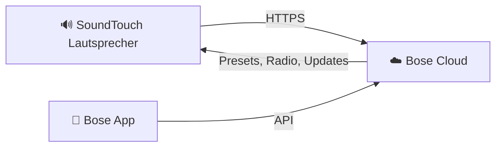
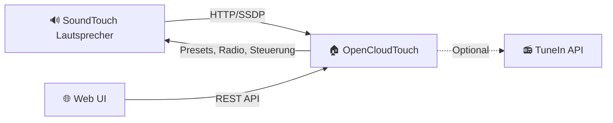

OpenCloudTouch ersetzt die Bose SoundTouch Cloud-Infrastruktur durch einen lokalen Dienst in deinem Netzwerk.

## Wie Bose SoundTouch funktioniert (Original)

Bose-Lautsprecher sind auf Cloud-Dienste angewiesen für Presets, Internetradio-Suche, Multi-Room-Koordination und Firmware-Updates. Als Bose diese Dienste abschaltete, verloren die Lautsprecher den Großteil ihrer smarten Funktionen.

## Wie OpenCloudTouch funktioniert

OpenCloudTouch fängt die Cloud-Aufrufe der Lautsprecher ab und fungiert als lokaler Ersatz:

- **SSDP-Erkennung** — findet Lautsprecher im Netzwerk automatisch
- **REST API** — bietet Preset-Verwaltung, Radio-Suche und Lautsprechersteuerung
- **Web UI** — browserbasierte Oberfläche für Konfiguration und Wiedergabe
- **Internetzugang erforderlich** — nötig für den ersten Start der Raspberry-Pi-Images (Container-Download), Updates und Internetradio-Streaming

## Was sich am Lautsprecher ändert

OpenCloudTouch benötigt kein Löten und keine Custom-Firmware, aber eine einmalige geräteseitige Umleitung, damit Cloud-Endpunkte auf deinen lokalen OCT-Host zeigen.

Typische Setup-Aktionen (abhängig von Modell/Firmware):

- Service-URL-Konfiguration im SoundTouch-System anpassen (BMX/Cloud-Endpunkt-Umleitung)
- `/etc/hosts`-Einträge für Bose-Domains setzen
- Umleitung verifizieren und Rollback-Backups vorhalten

Der Setup-Wizard führt diese Schritte geführt aus und unterstützt Backup/Restore.
Die Zugriffsmethode (SSH/USB oder Telnet) hängt von Lautsprechermodell und Firmware-Version ab.

## Komponenten

| Komponente | Technologie | Zweck |
|------------|-------------|-------|
| Backend | Python (FastAPI) | REST API, Lautsprecherkommunikation, SSDP-Erkennung |
| Frontend | React (TypeScript) | Webbasierte Steuerungsoberfläche |
| Datenbank | SQLite | Preset-Speicherung, Lautsprecher-Registrierung |
| Container | Docker | Deployment und Isolation |
| Raspberry Pi Image | Fertiges OS-Image | Sofort einsatzbereites Image mit allem vorkonfiguriert |

## Netzwerkanforderungen

OpenCloudTouch muss sich im **selben Netzwerksegment** wie deine Lautsprecher befinden. Es nutzt:

- **UDP 1900** — SSDP-Erkennung (Multicast)
- **UDP 5353** — mDNS (Multicast)
- **TCP 7777** — Web UI und REST API
