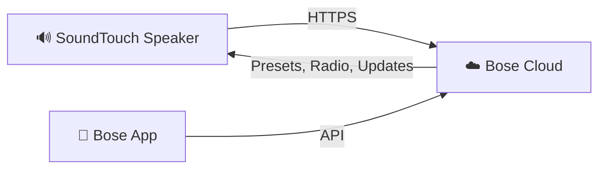
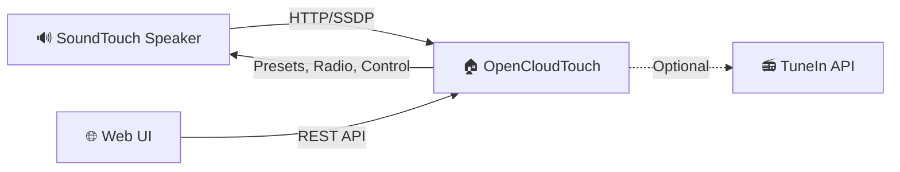

OpenCloudTouch replaces the Bose SoundTouch cloud infrastructure with a local service running on your network.

## How Bose SoundTouch Works (Original)

Bose speakers rely on cloud services for presets, internet radio station lookup, multi-room coordination, and firmware updates. When Bose shut down these services, speakers lost most of their smart functionality.

## How OpenCloudTouch Works

OpenCloudTouch intercepts the speaker's cloud calls by acting as a local replacement:

- **SSDP Discovery** — finds speakers on the network automatically
- **REST API** — provides preset management, radio lookup, and speaker control
- **Web UI** — browser-based interface for configuration and playback
- **Internet access required** — needed for initial Raspberry Pi image startup (container download), updates, and internet radio streaming

## What Changes on the Speaker

OpenCloudTouch does not require soldering or custom firmware, but it does require a one-time device-side redirect setup so cloud endpoints resolve to your local OCT host.

Typical setup actions (model/firmware dependent):

- Update SoundTouch service URL configuration (BMX/cloud endpoint redirect)
- Add `/etc/hosts` entries for Bose domains
- Verify redirect behavior and keep rollback backups

The setup wizard performs these steps in a guided flow with backup/restore support.
Access method (SSH/USB or Telnet) depends on speaker model and firmware version.

## Components

| Component | Technology | Purpose |
|-----------|------------|---------|
| Backend | Python (FastAPI) | REST API, speaker communication, SSDP discovery |
| Frontend | React (TypeScript) | Web-based control interface |
| Database | SQLite | Preset storage, speaker registry |
| Container | Docker | Deployment and isolation |
| Raspberry Pi Image | Pre-built OS image | Ready-to-flash image with everything pre-configured |

## Network Requirements

OpenCloudTouch needs to be on the **same network segment** as your speakers. It uses:

- **UDP 1900** — SSDP discovery (multicast)
- **UDP 5353** — mDNS (multicast)
- **TCP 7777** — Web UI and REST API
